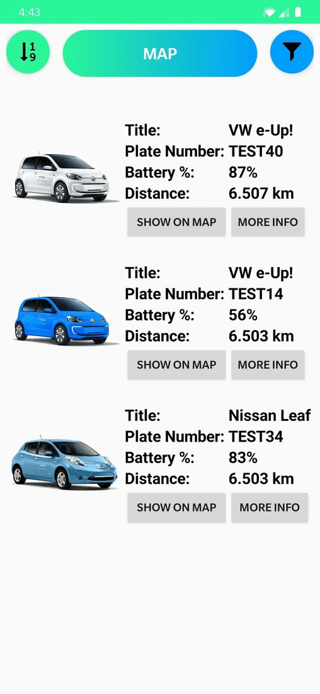

## Cars On Map

**Cars On Map is an application made using Android Studio. It is available on Android devices and suitable for normal screen sizes.**

The app takes information from API and uses it to show cars on the map also creates a list of all cars.

Main Features:
- Map with users location and custom markers of cars (using Google map)
- Get full list of cars from API
- Represent full details about the car
- Show location of certain car from the list
- Sorting by distance from user to certain car from the list (Issue: Need to visit map first)
- Filtering cars by Battery procentage (Full, mid, low)
- Filtering cars by Plate Number (using search bar)
